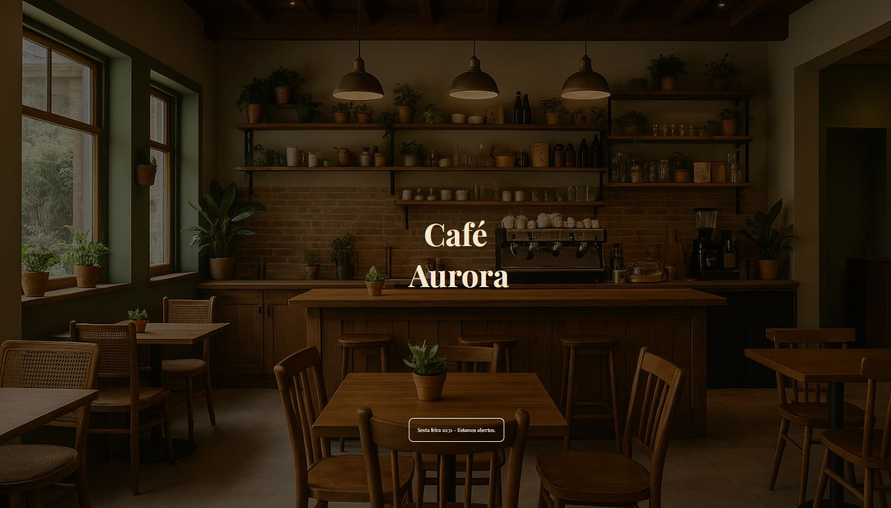
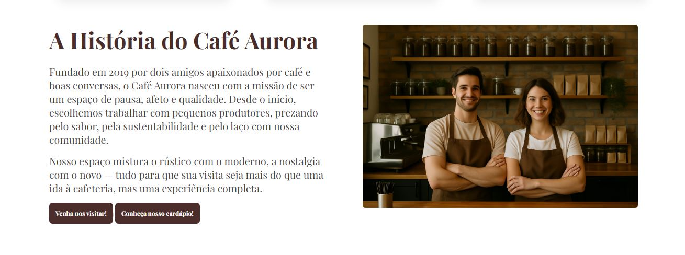
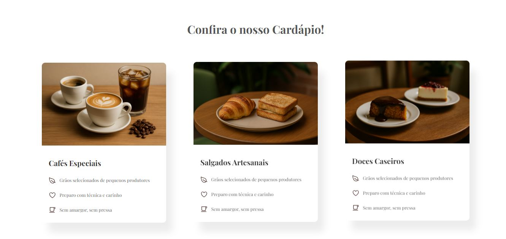
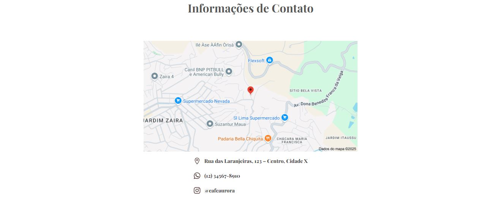

# Cafeteria Aurora Landing Page ☕

Landing page de uma cafeteria fictícia, criada do zero para portfólio.

## ✨ Sobre o projeto

Este projeto foi desenvolvido com foco em práticas de HTML e CSS, com atenção ao design e experiência de usuário.  
Todas as imagens foram geradas por IA e otimizadas para o projeto.

---

## 🖥️ Prévia do projeto

### 🎥 Navegação pela página

### 📸 Seções da página
- **Hero Section**  
  

- **Sobre a Cafeteria**  
  

- **Menu de Cafés**  
  

- **Contato**  
  

---

## 🛠️ Tecnologias utilizadas

- HTML5
- CSS3

---

## 📄 Licença

Este projeto é apenas para fins de estudo e portfólio.
